# Introduction

This project shows an example usages of local LLMs hosted by Llama server and a local search engine recoll that is available via MCP server. 

Recoll is a desktop search engine and an open source project. It is very powerful application that can index many document formats (pdf, text, etc.) and allows to perform advanced search queries. Please refer to https://www.recoll.org/ for more information about recoll. Recoll is backed by Xapian search engine library - a powerful search engine library. Please refer to https://xapian.org/ for more information about xapian.

# Prerequisite

This project was tested on Ubuntu 23.04.5 LTS. Firstly you need to install packages that provide recoll:

```
sudo apt install recoll python3-recoll
```

You need to create an index and update it:

```
recoll -z
recoll -u
```

This above step can also be performed via the recoll GUI application (please refer to https://www.recoll.org/usermanual/usermanual.html).

This repository contains an external project https://github.com/Overdr0ne/recoll-mcp-server.git that has been modified and fixed to support the recent version of python3-recoll available on Ubuntu 24.04.5 LTS packages.

Download and unzip the llama binary release from https://github.com/ggml-org/llama.cpp/releases

Download the model in GGUF format. For our experiments we're using: [NVIDIA-Nemotron3-Nano-4B-Q4_K_M.gguf](https://huggingface.co/nvidia/NVIDIA-Nemotron-3-Nano-4B-GGUF) that can be found here: https://huggingface.co/nvidia/NVIDIA-Nemotron-3-Nano-4B-GGUF/blob/main/NVIDIA-Nemotron3-Nano-4B-Q4_K_M.gguf

Note, that you need to accept the license (https://www.nvidia.com/en-us/agreements/enterprise-software/nvidia-nemotron-open-model-license/) before downloading and using that model!

# Running

To run the local LLM server execute following command:

```
./path/to/llama-server -m /path/to/NVIDIA-Nemotron3-Nano-4B-Q4_K_M.gguf
```

Once the model is loaded, open the following URL in your browser: http://127.0.0.1:8080/#/

A following screen should appear:

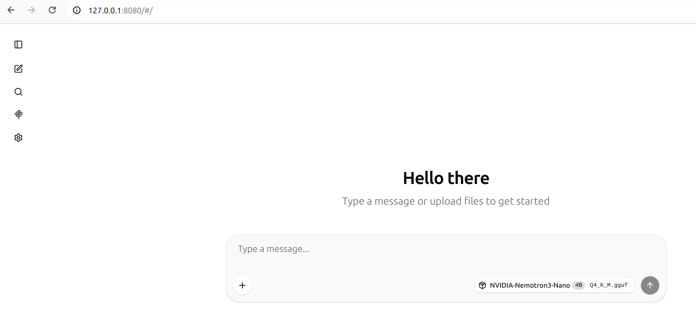

To run local recoll MCP server execute following command:

```
cd recoll-mcp-server
```

2. Create a Python virtual environment. You **must** use the `--system-site-packages` flag so the environment can access the system-installed `python3-recoll` package:

```bash
python3 -m venv venv --system-site-packages
source venv/bin/activate
```

Install required python packages:

```bash
pip install -U "mcp<2" starlette uvicorn websockets
```

Run the recoll MCP server.

```bash
./recoll_mcp_server.py
```

Once the server is started it will display something like that in the console:

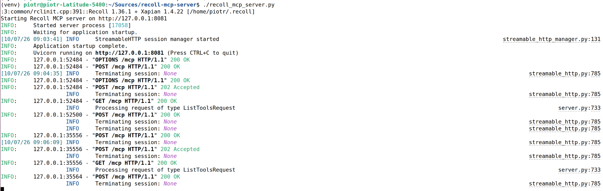

In the browser click "MCP Servers" button (located on the left panel). Once a dialog window appears, enter http://127.0.0.1:8081 into the Server URL text box and click "Add" button.

Once the recoll MCP server is properly addedd a following entry should appear in the list of servers:

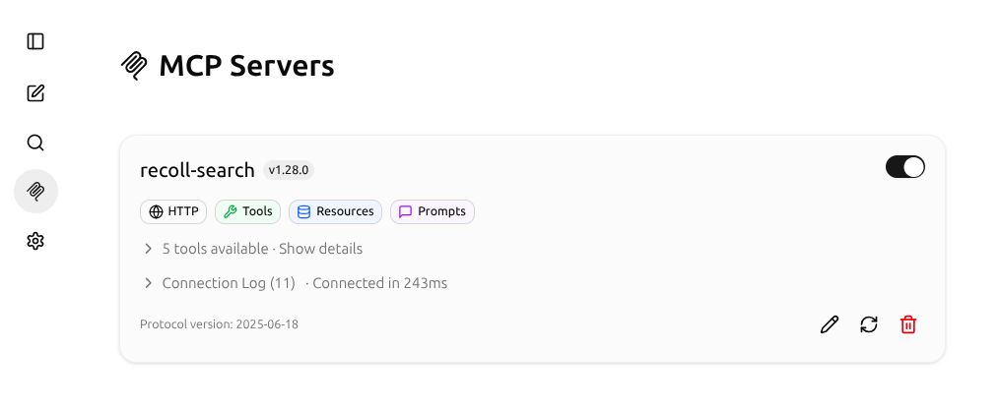

# Experiments

In the experimets we'll try to find information about SVD and its usage in data science. Here is the dump of the session:

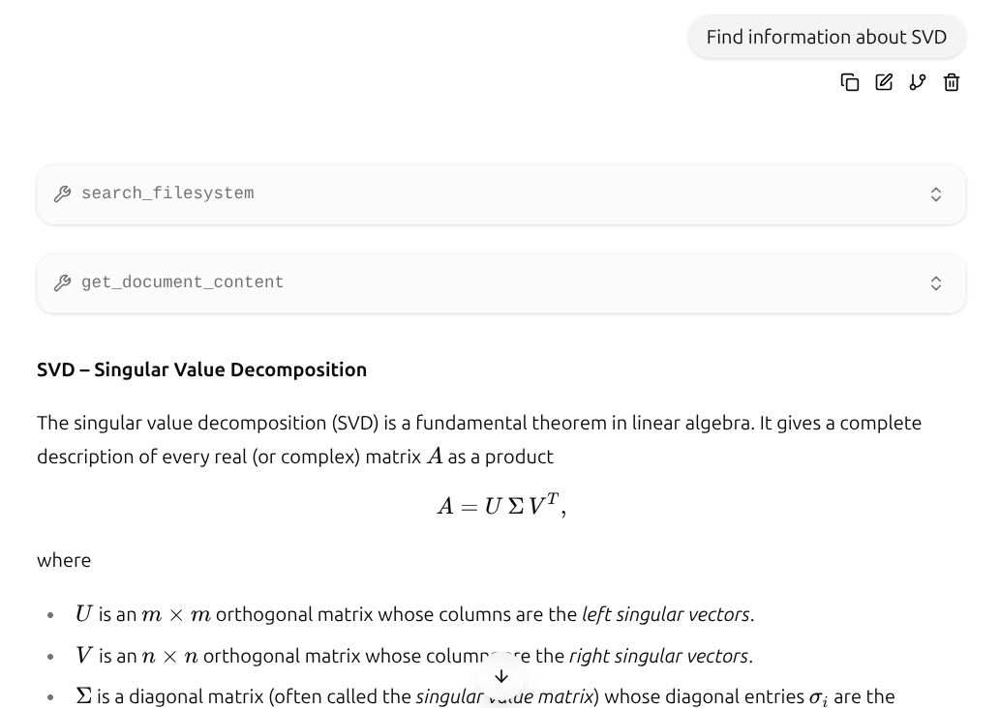
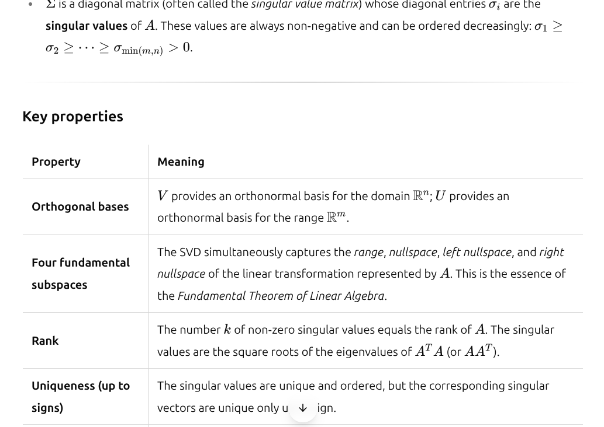
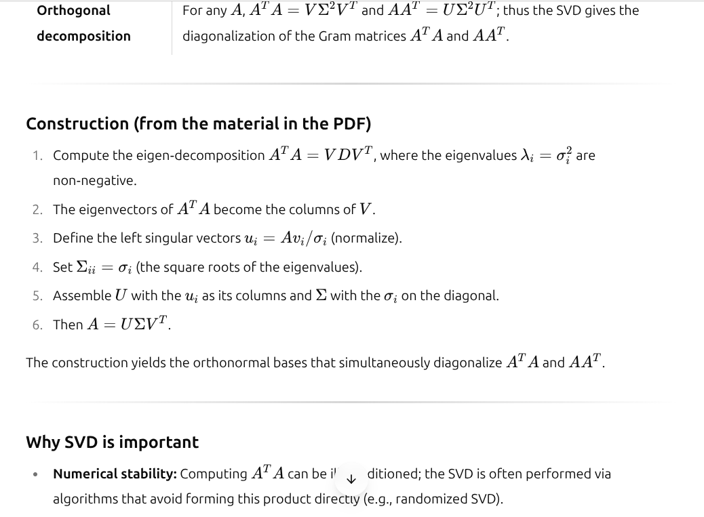
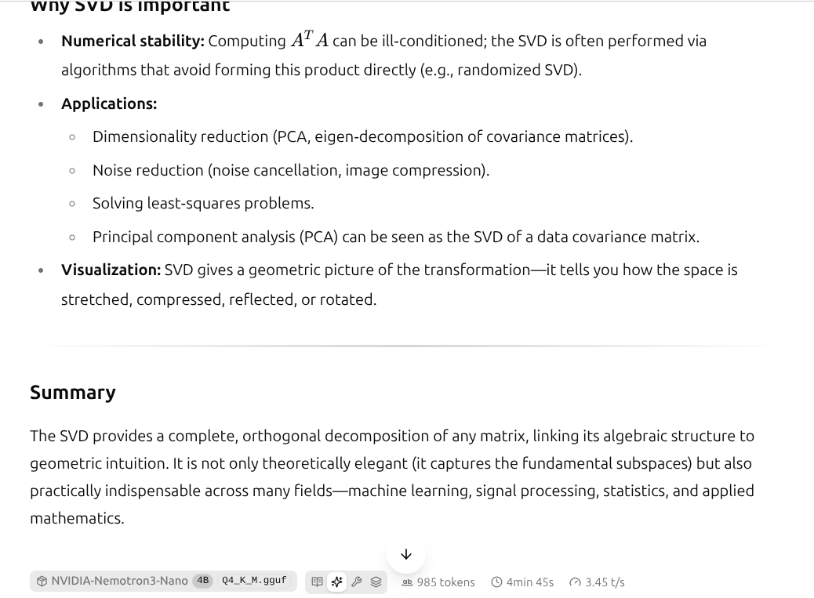
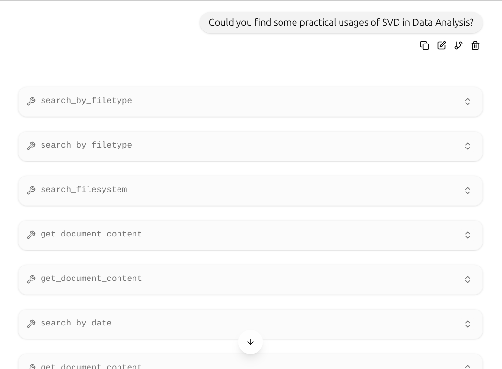
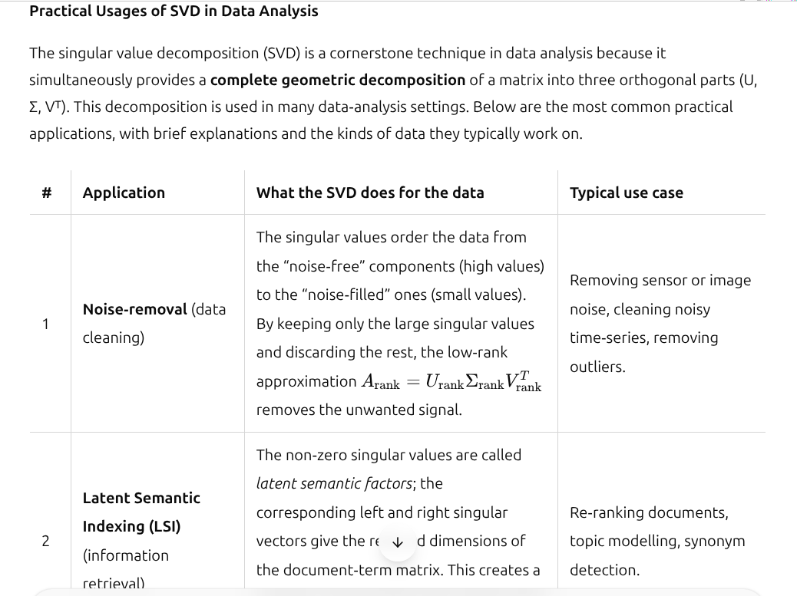
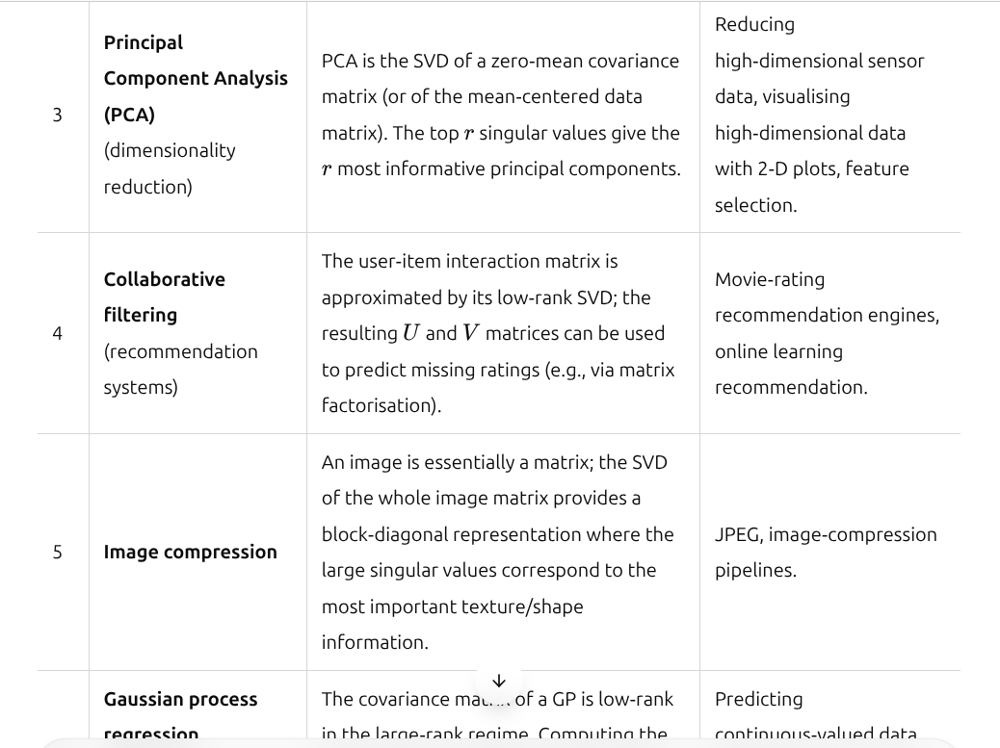
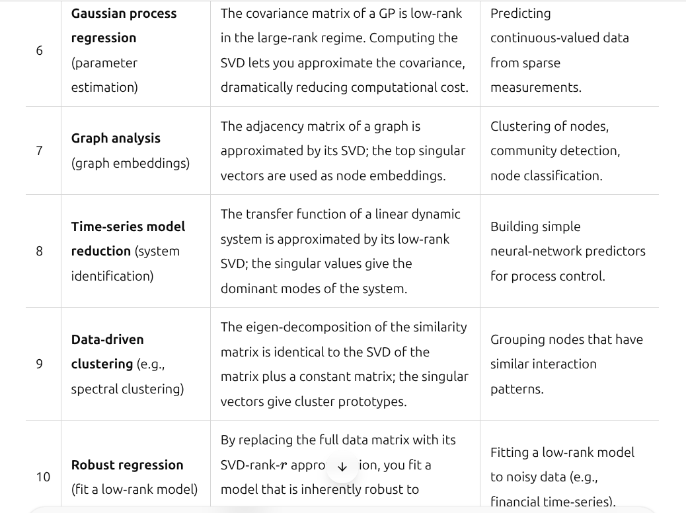
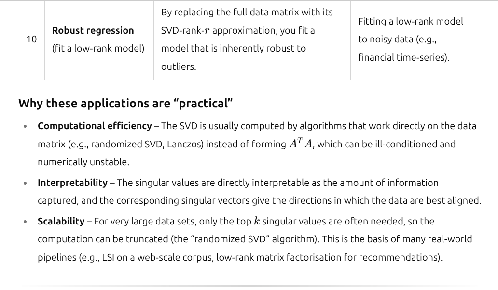
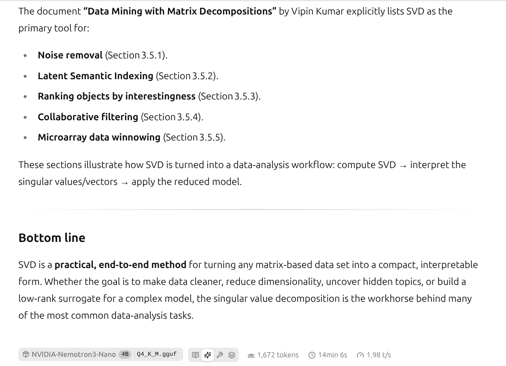

As we can see, the model properly use MCP recoll tool to find documents about SVD in our local document collection.

The disadvantage is that the model runs on CPU only thus the inference is quite slow. It takes about 4 minutes and 45 seconds to generate a response for the first prompt. The second prompt took 14 minutes and 6 seconds (DELL Laptop equipped with 32GB of RAM and eight Intel(R) Core(TM) i5-8365U CPU @ 1.60GHz cores).

Althought its slowness, it still might be useful to process large collection of documents locally without revealing information outside local PC. In some cases it might be crucial from the privacy point of view. 
